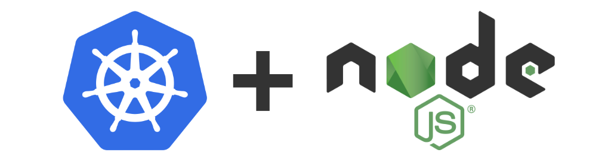

<p align="center">
  <a href="https://kubernetes.io/" target="blank"></a>
</p>

<h1 align="center">⭐ Express Kubernetes Example ⭐</h1>

<p align="center">
  Example of an express service working in Kubernetes
</p>

## 👀 Motivation

The main idea of this repository is to show how we can create an express service using typescript and running it in Kubernetes. Note that this repository is not a template for starting new projects so we will not keep it up to date in terms of dependencies, vulnerabilities or new practices, if you are looking for a new template we recommend you to check the [project templates](#-project-templates) section.

## 🤩 Project templates

Are you thinking in start new projects in nestjs, other frameworks or create a super fancy library? I recommend you to check the following templates I have been working on:

- [Template for new NestJS Services](https://github.com/AlbertHernandez/nestjs-service-template)
- [Template for new Typescript Libraries](https://github.com/AlbertHernandez/typescript-library-template)
- [Template for new Typescript Express Services](https://github.com/AlbertHernandez/express-kubernetes-example)
- [Template for new GitHub Actions based on NodeJS](https://github.com/AlbertHernandez/github-action-nodejs-template)

## 🧑‍💻 Developing

First, we will need to create our .env file, we can create a copy from the example one:

```bash
cp .env.example .env
```

The project is fully dockerized 🐳, if we want to start the app in **development mode**, we just need to run:

```bash
docker-compose up -d my-service-dev
```

This development mode with work with **hot-reload** and exposing a **debug port**, the `9229`, so later we can connect from our editor to it.

Now, you should be able to start debugging configuring using your IDE. For example, if you are using vscode, you can create a `.vscode/launch.json` file with the following config:

```json
{
  "version": "0.1.0",
  "configurations": [
    {
      "type": "node",
      "request": "attach",
      "name": "Attach to docker",
      "restart": true,
      "port": 9229,
      "remoteRoot": "/app"
    }
  ]
}
```

Also, if you want to run the **production mode**, you can run:

```bash
docker-compose up -d my-service-production
```

This service is providing just a health endpoint which you can call to verify the service is working as expected:

```bash
curl --request GET \
  --url http://localhost:3000/health
```

If you want to stop developing, you can stop the service running:

```bash
docker-compose down
```

## ⚙️ Building

```bash
npm run build
```

## ✅ Testing

The service provide different scripts for running the tests, to run all of them you can run:

```bash
npm run test
```

If you are interested just in the unit tests, you can run:

```bash
npm run test:unit
```

Or if you want e2e tests, you can execute:

```bash
npm run test:e2e
```

We also have performance testing with [k6](https://k6.io/), if you want to run it via docker, execute:

```bash
docker-compose up k6
```

Or if you want to run it from your machine, execute:

```bash
brew install k6
npm run test:performance
```

## 💅 Linting

To run the linter you can execute:

```bash
npm run lint
```

And for trying to fix lint issues automatically, you can run:

```bash
npm run lint:fix
```
