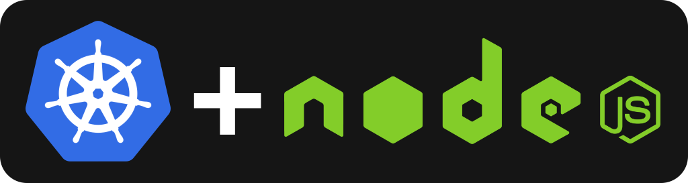
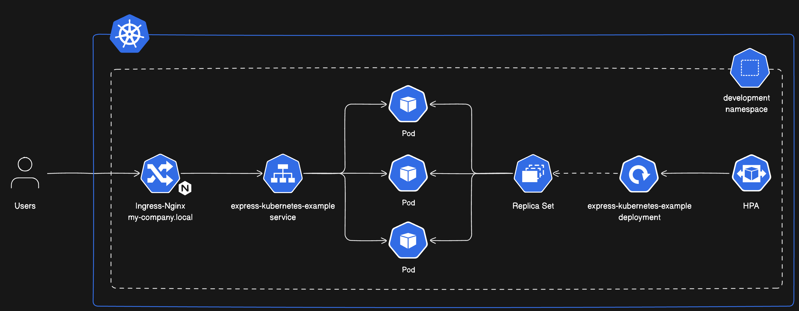

<p align="center">
  <a href="https://kubernetes.io/" target="blank"></a>
</p>

<h1 align="center">⭐ Express Kubernetes Example ⭐</h1>

<p align="center">
  Example of an express service working in Kubernetes
</p>

## 👀 Motivation

The main idea of this repository is to show how we can create an express service using typescript and running it in Kubernetes. Note that this repository is not a template for starting new projects so we will not keep it up to date in terms of dependencies, vulnerabilities or new practices, if you are looking for a new template we recommend you to check the [project templates](#-project-templates) section.

## ☁️ Cluster High Level Architecture



The cluster is composed by the following resources:

- **Namespace**: It is the resource that will group all the resources that are related to the development environment.
- **Ingress**: It is the entry point of the cluster, it will route the requests to the correct service. Is done using the [nginx-ingress](https://kubernetes.github.io/ingress-nginx/) controller.
- **Express Service**: Is in charge of group the set of Pods that are running the express application.
- **Pods**: Are the containers where the express application is running.
- **ReplicaSet**: Is the resource that will ensure that the number of pods is the desired one.
- **Deployment**: Indicates the rules to create and update the pods.
- **HPA**: Is the resource that will scale the pods based on the CPU and Memory usage.

# 🐳 Starting the Kubernetes cluster

In this section we are going to explain how to start the Kubernetes cluster using docker-desktop and all the resources we have defined.

## ⚙️ Installation

First, let's install [kubectl](https://kubernetes.io/docs/reference/kubectl/introduction/), that is a CLI for interacting with kubernetes, if you don't have it, and you are using a mac, you can install it using brew:

```shell
brew install kubectl
```

Now, we need to install [docker desktop](https://www.docker.com/products/docker-desktop) app. Once we have it, let's enable Kubernetes, we can do it by going to the settings and enabling the Kubernetes checkbox. For more information, you can check the [official documentation](https://docs.docker.com/desktop/kubernetes/).

## 🚀 Starting the cluster

Once docker desktop is running and Kubernetes is enabled, we need to build our docker image and create all the kubernetes resources we have configured, to do so we have automated the process with an script that you can run with:

```shell
./kubernetes/use-cases/create_kubernetes_cluster.sh
```

Now, you can get resources created in the cluster, for example, the pods, by running:

```shell
kubectl get pods -n development
```

Also, you should be able to perform request operations to the public services in the cluster, for example, the health endpoint of the express service:

```shell
curl -i http://my-company.local/api/health
```

If you want to deploy a new version of the service, you should make a new commit and run:

```shell
./kubernetes/use-cases/deploy_app.sh --app="express-kubernetes-example" --env="development"
```

In case you want to delete all the cluster, you can run:

```shell
./kubernetes/use-cases/delete_kubernetes_cluster.sh
```

## 🧑‍💻 Developing

First, we will need to create our .env file, we can create a copy from the example one:

```bash
cp .env.example .env
```

The project is fully dockerized 🐳, if we want to start the app in **development mode**, we just need to run:

```bash
docker-compose up -d my-service-dev
```

This development mode with work with **hot-reload** and exposing a **debug port**, the `9229`, so later we can connect from our editor to it.

Now, you should be able to start debugging configuring using your IDE. For example, if you are using vscode, you can create a `.vscode/launch.json` file with the following config:

```json
{
  "version": "0.1.0",
  "configurations": [
    {
      "type": "node",
      "request": "attach",
      "name": "Attach to docker",
      "restart": true,
      "port": 9229,
      "remoteRoot": "/app"
    }
  ]
}
```

Also, if you want to run the **production mode**, you can run:

```bash
docker-compose up -d my-service-production
```

This service is providing just a health endpoint which you can call to verify the service is working as expected:

```bash
curl --request GET \
  --url http://localhost:3000/health
```

If you want to stop developing, you can stop the service running:

```bash
docker-compose down
```

## 🤩 Project templates

Are you thinking in start new projects in nestjs, other frameworks or create a super fancy library? I recommend you to check the following templates I have been working on:

- [Template for new NestJS Services](https://github.com/AlbertHernandez/nestjs-service-template)
- [Template for new Typescript Libraries](https://github.com/AlbertHernandez/typescript-library-template)
- [Template for new Typescript Express Services](https://github.com/AlbertHernandez/express-kubernetes-example)
- [Template for new GitHub Actions based on NodeJS](https://github.com/AlbertHernandez/github-action-nodejs-template)
